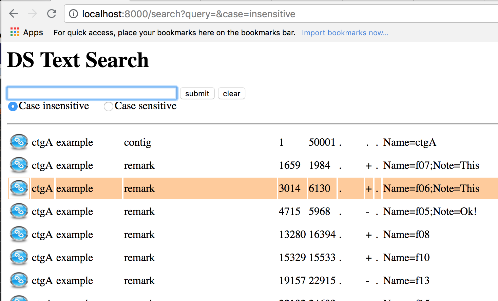
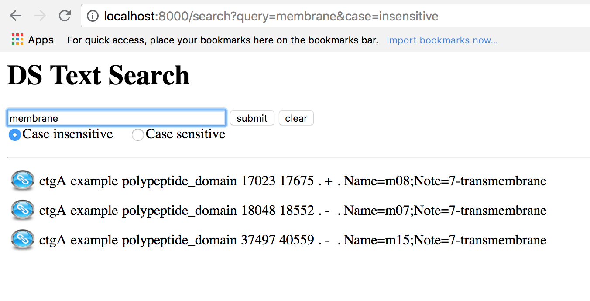
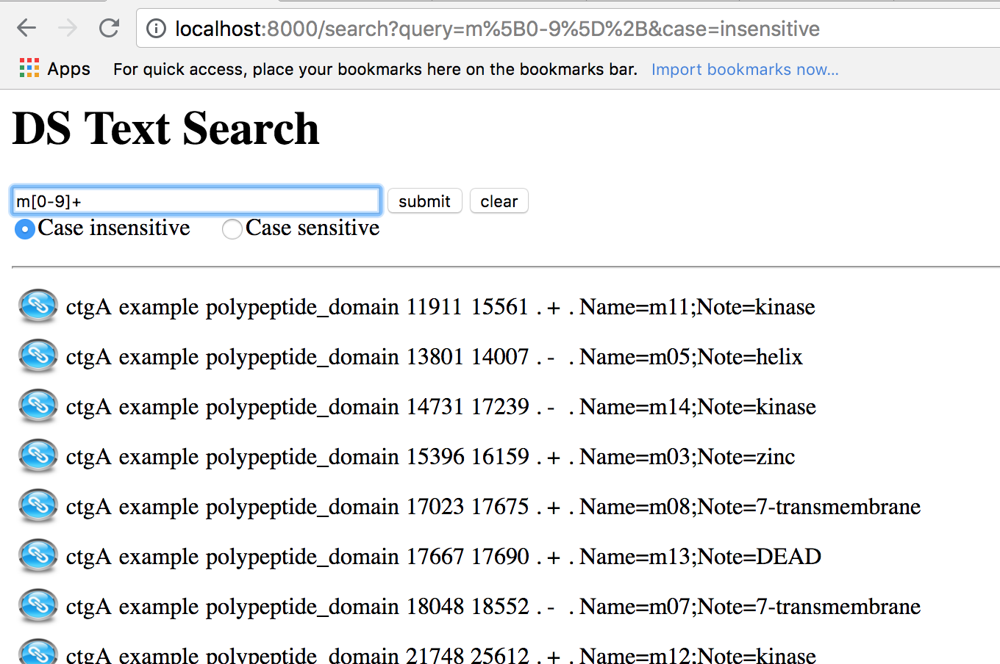

# DS-text-search

GFFファイルの検索とJBrowseとの連携

## 更新履歴

- version 0.2.0
  - 基本的な機能を実装した。
- version 0.1.0 
  - Spring Boot ver.5 + Apache Tiles ver.3 でコンパイルが成功する最低限の雛形を作成。[Github, spring-boot-web-mvc-tiles3 (2014)](https://github.com/mmeany/spring-boot-web-mvc-tiles3)をベースにしてパッケージ名などを調整した。

## インストール方法

### 前提

- Java version 10
- Apache maven version 3.5.3
- git (version 2.15.2)

### コンパイル方法

	git clone http://gitlab.ddbj.nig.ac.jp/oogasawa/ds-text-search
	cd ds-text-search
	mvn -Dmaven.test.skip=true clean package
	
これによりtargetディレクトリの下にjarファイルが生成される。

## 起動方法

以下のコマンドでds-text-searchが動作するwebサーバーが8000番ポートで起動する。（デフォルトは8080)

    java -jar target/ds-text-search-0.2.0.jar \
	    --server.port=8000 \
		--datafile=/home/your-account/your-data.gff3

## 使い方

ブラウザで http://localhost:8000/search にアクセスすると以下のような画面が表示される。

- 検索語を何も指定しないとgff3ファイルの全データが表示される。
- データにマウスオーバーすると行の背景色が反転する。
- 右端のリンクアイコンをクリックするとJBrowserで該当箇所が表示される。

検索語は正規表現で指定する。単に行全体に対して正規表現を探すので該当の文字列を入れるだけで文字列の途中のマッチを探すことができる。

メタキャラクタを使った正規表現の例は以下の通り。

